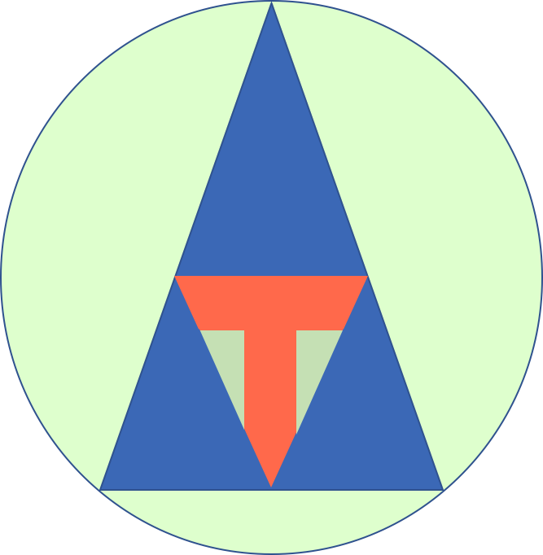

    

# AI Tester

As a developer, we want to focus on the development effort for the features.  If AI can read the code we write, and analyze the code, and write the tests for the code, it will be amazing!

So this project is to see how we can leverage the Machine Learning techniques, to analyze the code we write, and automate the unit and functional automation tests.

Visit our [web site](http://ai-tester.com)